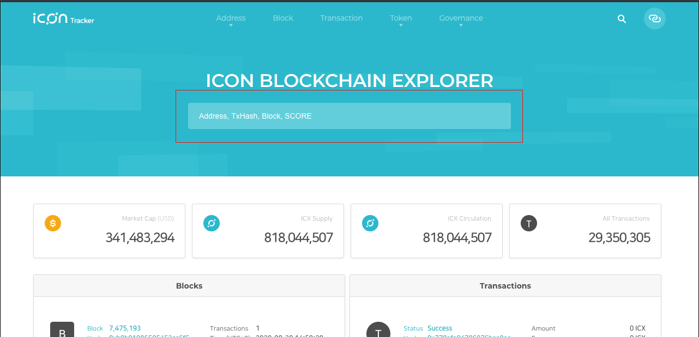
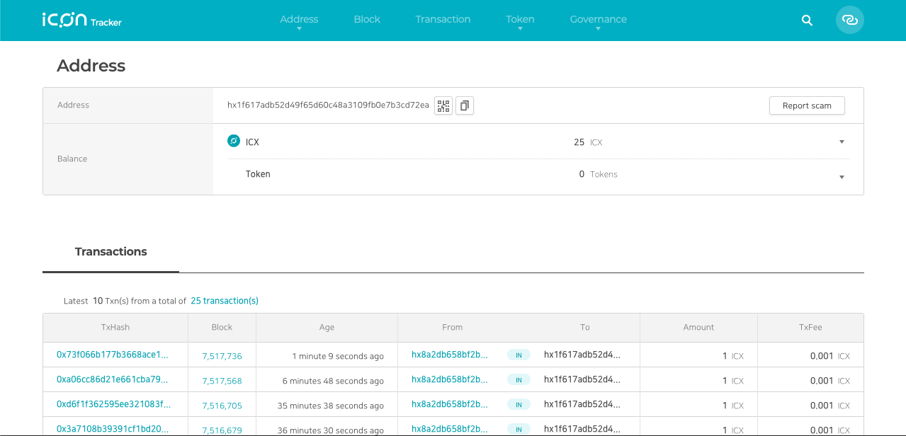
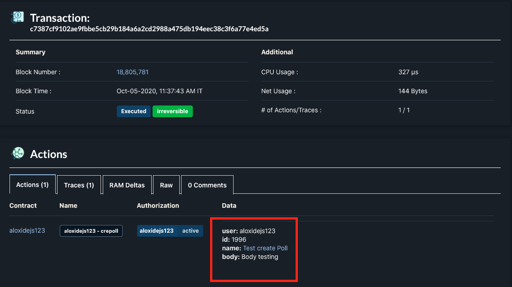
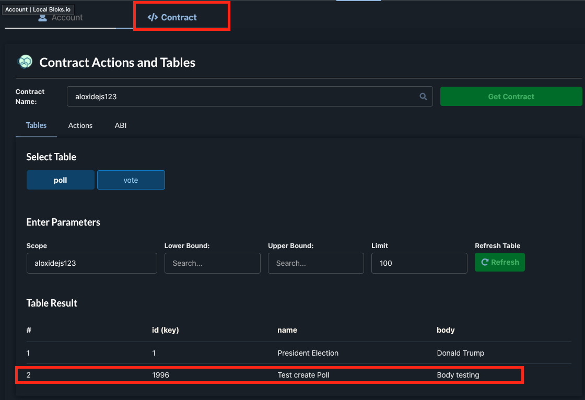
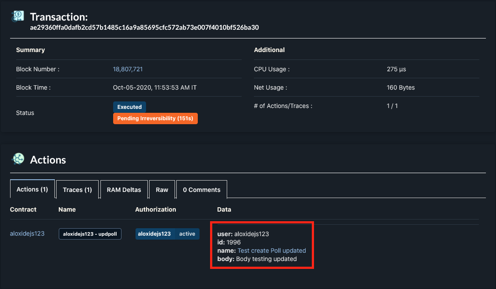

## Installation
1. Install envinronment:

    - brew install gradle
    
    - brew install android-sdk
2. Clone the repository [https://github.com/lecle/aloxide-sdk-java.git](https://github.com/lecle/aloxide-sdk-java.git).

3. Install dependencies: ./gradlew build

# ICON Network for Java SDK 
Wraper class from Icon Java SDK [https://www.icondev.io/docs/java-sdk](https://www.icondev.io/docs/java-sdk)

## Usage

Send ICX transaction

Example: Send **11** ICX from **c958108ccc79513ef9bf7647c29194199e3c5b86a88cbbc236dd5f74dfc37366** (Private key) to **hx1f617adb52d49f65d60c48a3109fb0e7b3cd72ea** (Address)
```
gradle myRun --args='c958108ccc79513ef9bf7647c29194199e3c5b86a88cbbc236dd5f74dfc37366  hx1f617adb52d49f65d60c48a3109fb0e7b3cd72ea 11'
```


Access to the ICON testnet block explorer to verify value
1. Go to this page [https://bicon.tracker.solidwallet.io/](https://bicon.tracker.solidwallet.io/)


2. And the search bar: search the address `hx1f617adb52d49f65d60c48a3109fb0e7b3cd72ea`



=====================================================================


# EOS Network for Java SDK 
Wraper class from EOSIO Java SDK [https://github.com/EOSIO/eosio-java](https://github.com/EOSIO/eosio-java)

# Procedure
**To add data to blockchain by running**
```
gradle add --args=Poll aloxidejs123 1996 “Test create Poll” “Body testing”
```

This command line to create a Poll with id=1996 name=Test create Poll and body=Body testing, the result is a transaction id (ex: c7387cf9102ae9fbbe5cb29b184a6a2cd2988a475db194eec38c3f6a77e4ed5a)

The result will the same with JavaScript SDK above. Access to this url to verify the result: https://local.bloks.io/transaction/c7387cf9102ae9fbbe5cb29b184a6a2cd2988a475db194eec38c3f6a77e4ed5a?nodeUrl=history.testnet.canfoundation.io&coreSymbol=CAT&systemDomain=eosio





**To update update existing data in blockchain, by running**
```
gradle set --args=Poll aloxidejs123 1996 “Test create Poll updated” “Body testing updated”
```



After we run this script the data will be changed, access this link to verify: https://local.bloks.io/transaction/ae29360ffa0dafb2cd57b1485c16a9a85695cfc572ab73e007f4010bf526ba30?nodeUrl=history.testnet.canfoundation.io&coreSymbol=CAT&systemDomain=eosio

**To get data from blockchain, by running**
```
gradle get --agrs=1996
```
This command will get data value of the id from the Poll entity, the result is the current value of the Poll with id = 1996.

In order to verify this feature, we can:
- Go to the block explorer https://local.bloks.io/account/aloxidejs123?nodeUrl=history.testnet.canfoundation.io&coreSymbol=CAT&systemDomain=eosio.
- Click to the Contract tab - Table section
- See that the data in Table is the same with the data received when running script
